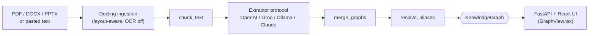

# InkMap

[](https://github.com/Tarek-yagami/InkMap/actions/workflows/tests.yml)

Turns a research paper into an interactive map of its entities and relationships. Upload a PDF (or DOCX/PPTX), or paste text directly, and the app extracts technologies, methods, concepts, people, organizations, and datasets, along with how they relate to each other, then renders the result as "Ink Bloom": a physics-driven network with glowing category halos and hover-revealed labels, in either dark or light.

A FastAPI backend wraps the pipeline as an HTTP + SSE API, with a React frontend on top, deployed live at [inkmap.onrender.com](https://inkmap.onrender.com).


## Architecture



```
src/
├── schema.py              # domain model: Node, Edge, KnowledgeGraph
├── chunking.py            # splits text into overlapping chunks, same for every input source
├── ingestion.py           # document -> plain text, via Docling (layout-aware, OCR off)
├── extraction/
│   ├── base.py               # Extractor protocol
│   ├── prompt.py             # extraction task description, shared by every Extractor
│   ├── openai_compatible.py  # one Extractor implementation for any OpenAI-compatible API
│   ├── anthropic_extractor.py # Extractor for Claude's Messages API (a genuinely different shape)
│   ├── providers.py          # provider presets (OpenAI, Groq, Ollama, Claude), keyed by kind
│   └── factory.py            # builds the right Extractor for a chosen provider/model
├── graph/
│   └── merge.py           # exact-match dedup, then lexical alias resolution ("Noam" -> "Noam Shazeer")
└── pipeline.py             # orchestrates chunking -> extraction -> merging
backend/                     # FastAPI: wraps the src/ pipeline as an HTTP + SSE API
├── main.py                # app setup, serves frontend/dist/ once built (same origin, no CORS needed)
├── config.py              # deployment env vars (hidden providers), read lazily like providers.py
├── routers/                # /api/providers, /api/jobs (start, SSE progress stream, plain status)
├── jobs/                   # in-memory job store + background runner (single worker only, by design)
└── rate_limit.py           # per-IP job-creation limit + upload size cap, protects the shared API key
frontend/                    # React + TypeScript (Vite), the "Ink Bloom" graph ported into a real component
Dockerfile                    # multi-stage: builds frontend/, then the Python runtime that serves both
render.yaml                   # Render Blueprint: one Docker web service
```

The pipeline depends on the `Extractor` protocol in `extraction/base.py`, not on any specific provider. OpenAI, Groq, and local Ollama models all speak the same OpenAI-compatible chat completions API, so one `OpenAICompatibleExtractor` class handles all three; `providers.py` just points it at a different `base_url`/`api_key`. Adding another OpenAI-compatible provider (OpenRouter, Together, ...) means adding one entry to `providers.py`, not a new class. Claude's Messages API is a genuinely different shape (its own request format and structured-output mechanism via forced tool use rather than `response_format`), so it gets its own `AnthropicExtractor` class; `providers.py` marks each entry with a `kind`, and `factory.py` dispatches on that, so `pipeline.py` and both frontends never know or care which concrete class they're talking to. Document parsing goes through Docling rather than a bare PDF text extractor, since research papers are usually multi-column and naive extraction scrambles reading order and mangles tables, which directly hurts extraction quality downstream. OCR is disabled since these are digital-native documents, not scans.

## Engineering notes

A few decisions worth explaining, each one settled by actually testing it rather than assuming:

- **A second, non-OpenAI-compatible provider was added to prove the `Extractor` protocol is a real seam, not just an OpenAI wrapper.** Claude's Messages API has its own request shape and its own structured-output mechanism (forced tool use), unlike OpenAI/Groq/Ollama which all happen to share one wire format. `AnthropicExtractor` implements the same protocol as a genuinely different class, with no changes to `pipeline.py` or either frontend. Verified with realistic mocks matching the actual Anthropic SDK's response shapes (including a case where Claude prepends a plain-text block before the forced tool call) rather than a live run, since no Anthropic budget is set up for this project.
- **A real bug caught by CI, not by local testing.** Adding Claude's provider entry led to writing the first test that ever constructed the OpenAI extractor with no `OPENAI_API_KEY` anywhere in the environment. Locally that env var happened to already be set, so it passed; on CI's clean environment it failed, because the OpenAI SDK now raises at construction time when no key is found anywhere, rather than waiting for the first real request. That's not just a test artifact: on the live deployment, where only `GROQ_API_KEY` is configured, selecting "OpenAI" would have crashed job creation outright the same way. Fixed by giving every provider, OpenAI included, the same explicit non-empty placeholder fallback already used for Groq and Ollama, so a missing key surfaces as a normal failed API request instead of a crash.
- **Docling over a plain PDF text extractor.** Verified on a real multi-column paper, not just claimed: reading order came out correct across the two-column layout, and a results table survived extraction as an actual markdown table with the right numbers in the right columns.
- **Embedding similarity was tried for entity resolution, then rejected.** The plan was to collapse aliases like "Noam" and "Noam Shazeer" using sentence-embedding similarity. Real scores told a different story: the genuine alias pair scored 0.64, while unrelated pairs like "encoder"/"decoder" (0.70) and "self-attention"/"multi-head attention" (0.67) scored higher. No threshold could separate real aliases from merely-related concepts, so a narrow lexical heuristic (substring, pluralization, acronym-initials matching) replaced it, verified against both the real cases and adversarial non-matches like "AI" against "domain."
- **GPT-OSS's hidden reasoning cost was found by testing a single request, not reading docs.** A one-word test request burned 89 of its 107 completion tokens on hidden reasoning the model never shows. Setting `reasoning_effort="low"` cut that to 14 of 28, roughly an 84% drop, with no visible loss in extraction quality.
- **Hugging Face Spaces was the original deployment target, ruled out after real testing.** A live forum report of async background work blocking responses on Spaces raised doubts before Docker-type Spaces turned out to need a paid plan on this account anyway. Switched to Render, then verified live on the actual deployment (not assumed) that progress events arrive with real timing gaps rather than being buffered, and that forcibly dropping the connection mid-extraction and reconnecting resumes cleanly with no lost or duplicated events.
- **Chunk size was tuned by measurement.** Bigger chunks mean fewer requests and less fixed per-request overhead, but the obvious "just make chunks bigger" move was checked against real output first: on the same paper, chunk sizes of 2000, 3000, and 4000 characters were each run for real, and the largest size traded a real ~20% drop in extracted entities for its speed gain. 3000 was picked as the deliberate middle ground, not the fastest option.
- **A real SSE bug, caught by watching actual timestamps, not by reading the code.** The progress stream emitted a "current state" snapshot on connect in addition to replaying its backlog queue, so the same progress steps briefly appeared twice, in the wrong order (jumping to 3/8, then back to 1/8, then forward again). Fixed by removing the redundant snapshot once `curl` showed the actual sequence.
- **Per-IP rate limiting reuses `aiolimiter`, already a dependency for pacing outgoing LLM calls, instead of adding a new library for incoming request limiting.** The public deployment shares one real API key across every visitor, with no protection otherwise against a script hammering it. `aiolimiter`'s own `acquire()` waits for capacity, which is right for pacing outgoing calls but wrong for rejecting an abusive client immediately, so it's paired with the non-blocking `has_capacity()` check instead. Verified live against the running server, not just in tests: 5 rapid job submissions succeed, the 6th gets a 429, and a 16&nbsp;MB upload gets a 413 before it ever reaches Docling.

## Setup

With [uv](https://docs.astral.sh/uv/) (recommended, much faster):

```bash
uv sync
copy .env.example .env      # then fill in the key(s) for whichever provider(s) you'll use
```

Without uv, plain pip works too, reading the same `pyproject.toml`:

```bash
python -m venv .venv
.venv\Scripts\activate      # Windows
pip install .
copy .env.example .env
```

For Ollama, no API key is needed, just [Ollama](https://ollama.com) running locally with a model pulled (e.g. `ollama pull llama3.1`).

## Usage

```bash
cd frontend && npm install && npm run build && cd ..
uv run uvicorn backend.main:app --reload
```

Open `http://localhost:8000`. The backend serves both the API and the built frontend from the same origin, so there's no separate frontend dev server needed once it's built once; for active frontend development, `npm run dev` inside `frontend/` proxies `/api` to the backend automatically (see `frontend/vite.config.ts`).

### Deployment

Deployed as one Docker container to [Render](https://render.com) (free tier, no card required):

```bash
docker build -t inkmap .
docker run -p 8000:8000 --env-file .env inkmap
```

To deploy for real: connect the GitHub repo on Render (New → Blueprint, it picks up `render.yaml` automatically), then set `GROQ_API_KEY` as a secret in Render's dashboard. `INKMAP_HIDDEN_PROVIDERS=Ollama (local)` is already set in `render.yaml`, since a public deployment has no route to a visitor's own machine.

## Testing

```bash
uv run pytest              # backend: 47 tests
cd frontend && npm test    # frontend: component + hook tests
```

Backend tests cover the pure and mockable logic: chunking, merge/alias resolution, pipeline orchestration (progress reporting, partial-chunk-failure tolerance), provider config, and both extractors. Docling ingestion isn't covered yet since it needs a bundled PDF fixture and a much slower test run; that's a reasonable next addition, not an oversight.

Frontend tests cover `UploadForm` (provider/model defaults, the Ollama free-text model field, validation, and the actual `FormData` sent to the backend) and `useJobProgress` (state transitions on progress/complete/failed SSE events, and that changing or clearing the job id closes the previous subscription). Both test suites run in CI as separate parallel jobs.

## Tech stack

FastAPI, React, TypeScript, OpenAI-compatible structured extraction (OpenAI, Groq, Ollama) and Anthropic's Claude, Pydantic, Docling, D3.js, LangChain text splitters, Docker, Render.

## Roadmap

- **Cross-paper knowledge base**: persist extracted graphs across sessions instead of rebuilding one per upload, so entities accumulate into a growing knowledge base rather than a single-paper snapshot.
- **Literature review support**: once entities resolve across papers, surface things like which papers cite or build on the same concepts, and where consensus or disagreement between papers shows up in the graph.

Within-paper entity resolution (see Engineering notes above) is already handled by `resolve_aliases` in `merge.py`, scoped to one paper's already-merged nodes. Resolving aliases *across* papers is a harder problem tied to the cross-paper knowledge base above.
